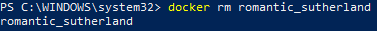

# **Docker Les Bases :**

Ce projet a pour but de fournir des informations sur les bases du fonctionnement de Docker.

## Auteur :

[Ryan Ladmia](https://www.github.com/RyanLadmia)  

Adresse email : ryan.ladmia@laplateforme.io


## A Propos de moi :

Je suis un developpeur fullstack, actuellement en formation à La Plateforme l'école du numérique.  
J'envisage de m'orienter vers la conception d'applications puis vers la cybersécurité.


## Utilisation :

**1. Vérifier la version de Docker :**
```
docker --version
``` 
Cette commande permet de vérifier si Docker est installé sur le système et quelle est sa version.  

Exemple :


**2. Informations générales :**
```
docker info
```
Cette commande permet d'afficher des informations générales sur l'installation de Docker (nombre de conteneurs actifs, images stockées, etc.).

Exemple :


**3. Conteneurs actifs :**
```
docker ps
```
Cette commande permet d'afficher uniquement les conteneurs actifs (qui tournent actuellement).  
-a = liste tous les conteneurs (actifs et arrêtés).  
-q = liste unique les IDs des conteneurs

Exemple 1 : aucun conteneur ne tourne.


Exemple 2 : un conteneur en train de tourner.


**4. Afficher les images :**
```
docker images
```
Cette commande permet d'afficher toutes les images Docker stockées localement sur ta machine.

Exemple 1 : aucune image active. 


Exemple 2 : image active.


**5. Exécuter un conteneur :**
```
docker run [OPTIONS] <nom_de_l_image> [COMMANDE] [ARGUMENTS]
```

Exemple :
```
docker run -d -p 8080:80 docker/welcome-to-docker
```
La commande docker run sert à créer et exécuter un conteneur à partir d'une image :  
-d = détachable (ne se coupe pas si le terminal est fermé).  
-it = interactif (se coupe si le terminal est fermé).  
-p = lier un port du PC avec un port du conteneur. Ici le port 8080 est du PC est lié au port 80 du conteneur.  
-rm = supprime le conteneur lorsque qu'il est arrêté ou que le terminal est ferme.

Exemple 1 : sans instructions ( docker run )


Exemple 2 : avec instructions


```
docker run -it --rm -p 8080:80 docker/welcome-to-docker
```
ou

Exemple : 


Resultat :


**6. Arrêter un conteneur :**

```
docker stop <nom_du_conteneur>  
```
ou

```
docker stop <id_du_conteneur>
```

Ces commande envoient un signal SIGTERM au conteneur, lui demandant de s'arrêter proprement en lui laissant le temps de le faire. Si le conteneur ne répond pas dans un délai donné (10 secondes par défaut), Docker envoie un signal SIGKILL pour forcer l'arrêt.

On peut aussi arrêter plusieurs conteneurs à la fois :

```
docker stop nom_conteneur1 nom_conteneur2
```

De plus on peut arrêter tous les conteneurs actifs :

```
docker stop $(docker ps -q)
```
docker ps -q récupère tous les IDs des conteneurs actifs, et docker stop les arrête tous en une seule commande.

Exemple avec le nom :


Exemple avecc l'ID :


La commande suivante :

```
docker kill <nom_du_conteneur>
```

envoie un signal SIGKILL pour arrêter immédiatement le conteneur, sans lui laisser le temps de se fermer proprement.

Exemple :


**7. Supprimer un conteneur :**

```
docker rm <nom_du_conteneur>
```
```
docker rm <id_du_conteneur>
```
Cette commande permet de supprimer un conteneur.  
UN CONTENEUR DOIT ÊTRE ARRÊTE AVANT D'ÊTRE SUPPRIMER.  


```
docker rm -f
```
Cette commande est utilisée pour forcer la suppression d'un conteneur en cours d'exécution (actif).  
Les options pour supprimer un conteneur sont les mêmes que pour la commande d'arrêt des conteneurs.  


- Supprimer plusieurs conteneurs :
```
docker rm <nom_du_conteneur> <nom_du_conteneur2>
```


- Supprimer tous les conteneurs arrêtés :
```
docker rm $(docker ps -aq)
```


- Supprimer une image :
```
docker rmi <nom_de_l_image>  
```
ou
```
docker rmi <ID_de_l_image>
```


- Supprimer plusieurs images :
```
docker rmi <image_1> <image_2> <image_3>
```


- Supprimer les images inutilisées :
```
docker image prune
```
Cela supprime les images non utilisées par au moins un conteneur.


- Supprimer les images non utilisées :
```
docker image prune -a
```
Cela supprime toutes les images qui ne sont plus utilisées par un conteneur actif ou arrêté


- Forcer la suppression d'une image :
```
docker rmi -f <nom_de_l_image>
```
ou
```
docker rmi -f $(docker images -q)
```
 -f force la suppression même si l’image est utilisée.
- Supprime toutes les images, même celles utilisées.


Exemple : 




**8. Les erreurs :**

- Suppression d'une image utilisée par un conteneur actif :  

Si tu essaies de supprimer une image utilisée par un conteneur actif, tu auras une erreur du type :
```
Error response from daemon: conflict: unable to remove repository reference ...
```

Correction : 
 
Arrêter et supprimer les conteneurs liés avant.  
```
docker stop $(docker ps -q) && docker rm $(docker ps -aq)
docker rmi <nom_de_l_image>
```


