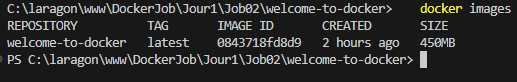
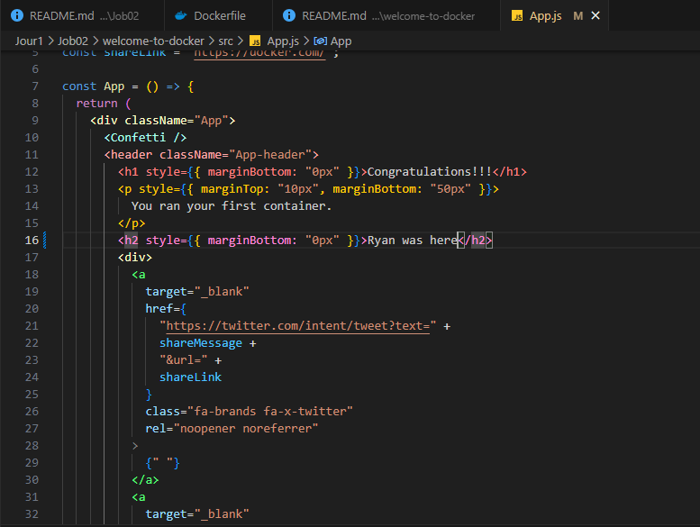
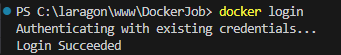

# Création de l'image :

```
docker build -t welcome-to-docker .
```

Lors de la création de l'image, j'ai eu un message d'erreur indiquant que la version de Node.js dans l'image Docker (v18.20.6) n'est pas compatible avec la version de npm que j'essaies d'installer (npm@11.1.0), qui nécessite Node.js v20.17.0 ou supérieur. J'ai donc procédé à une modification du fichier Dockerfile comme ceci  :


J'ai ensuite réussi à créer l'image.  
  

  
  

# Lancement de l'image Docker et du conteneur :  
```
docker run -p 3000:3000 welcome-to-docker
```


  


# Vérifier si le conteneur est lancée :
```
docker ps
```
  

  


# Vérifier les images actives :

```
docker images
```


  


# Accèder au conteneur :
  

  


# Modification du code ligne 16 :




# Arrêt et suppression :


# Création d'une nouvelle image :


# Visualisation :


# Connexion à mon compte :




# Création d'une nouvelle image avec un nom différent :


# Tag et publication :


Dans Docker desktop :


 

# Récupérer l'image de quelqu'un :


# Repérer le dossier contenant le code :

Ouvrir le Terminel de Docker Desktop et tapper :
```
docker exec -it Const-Ibrahim sh
```


Puis tapper j'ai tappé cette commande dans le terminal de VsCode :


