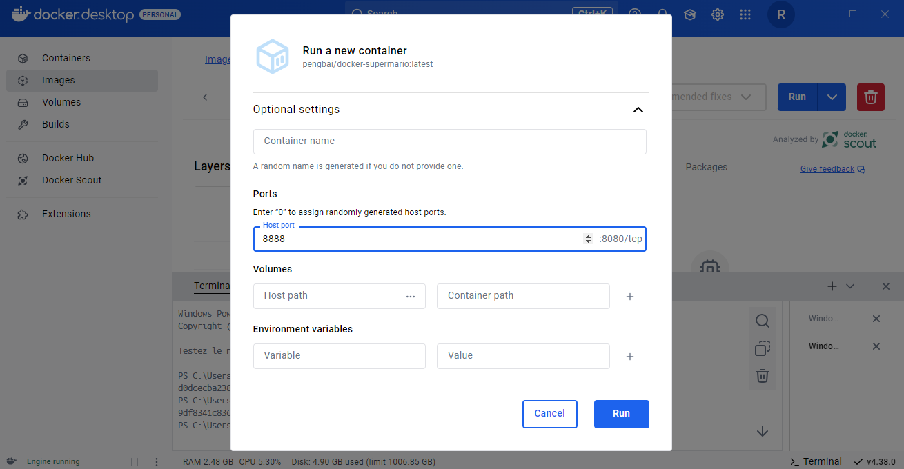
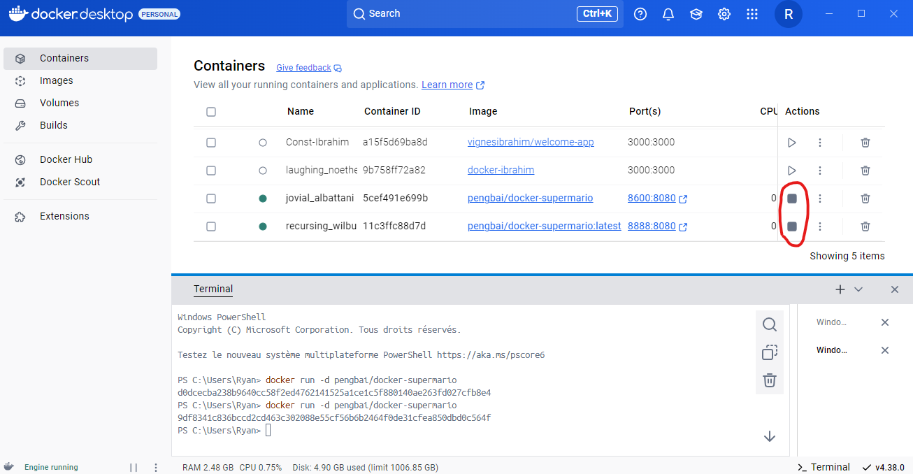
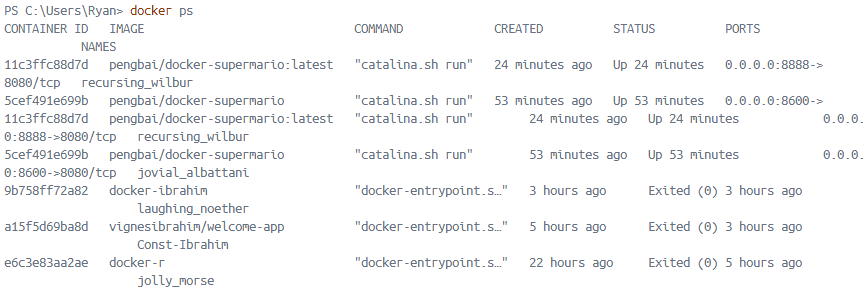

# Terminal de Docker Desktop :


# Chercher une image dans Docker Desktop :


# Pull une image sur Docker Desktop :


# Ajout de l'image dans la liste :


# Lancer un conteneur :  

assignez lui le port 8600 en considérant que l’image est configuré sur le port 8080 et en conservant l'accès à l’invite de commande :  

- Méthode n°1 :
```
docker run -it -p 8600:8080 pengbai/docker-supermario
```  
Pour que le conteneur tourne en arrière plan :
```
docker run -d -p 8600:8080 pengbai/docker-supermario
```


Le résultat se trouve à localhost:8600 :


- Méthode n°2 :  

Lancer un conteneur sans lui donner de port :
```
docker run -d pengbai/docker-supermario
```


Puis aller dans Images,  
Puis cliquer sur le lien de l'image :


Puis aller sur Run :


Puis attribuer manuellement un port :




Le résultat se trouve à localhost:8888


# Fenêtre Images :

Lorsque les conteneurs se lance voici ce qu'il se passe :



# Résultats des conteneurs qui tournent :


# Voici les capture d'écran du jeu dans le navigateur :

  
  


# Arrêter un conteneur par son ID :

- 1ère façon de trouver l'ID :
```
docker ps
```


```
docker ps -a
```



- 2ème façon de trouver l'ID :


- 1ère façon d'arrêter un conteneur :
```
docker stop <id_du_conteneur>
```
ou
```
docker stop <nom_du_conteneur>
```
Résultat :


- 2ème façon :  
Cliquer sur stop sans utiliser le Terminal :


# Supprimer un conteneur :

- 1ère méthode avec le nom :
```
docker rm <nom_du_conteneur>
```
ou
```
docker rm <id_du_conteneur>
```


- 2ème méthode en cliquant :


 