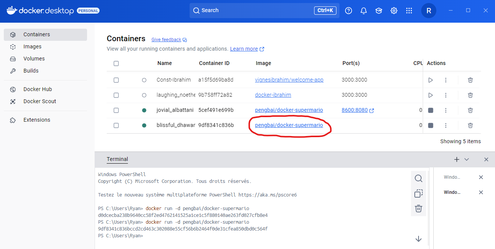

# Terminal de Docker Desktop :


# Chercher une image dans Docker Desktop :


# Pull une image sur Docker Desktop :


# Ajout de l'image dans la liste :


# Lancer un conteneur :  

assignez lui le port 8600 en considérant que l’image est configuré sur le port 8080 et en conservant l'accès à l’invite de commande :  

- Méthode n°1 :
```
docker run -it -p 8600:8080 pengbai/docker-supermario
```  
Pour que le conteneur tourne en arrière plan :
```
docker run -d -p 8600:8080 pengbai/docker-supermario
```


Le résultat se trouve à localhost:8600 :


- Méthode n°2 :  

Lancer un conteneur sans lui donner de port :
```
docker run -d pengbai/docker-supermario
```


Puis aller dans Images,  
Puis cliquer sur le lien de l'image :



Puis aller sur Run :


Puis attribuer manuellement un port :


