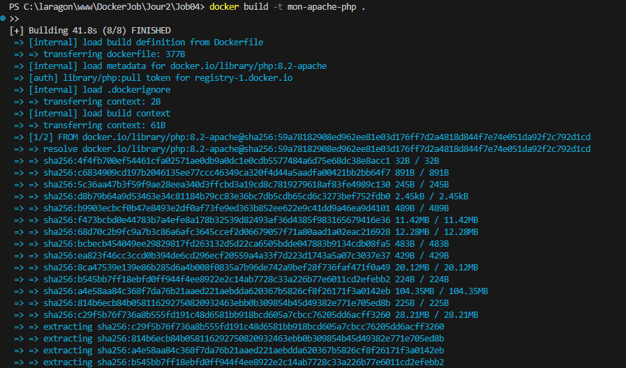
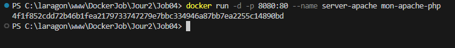
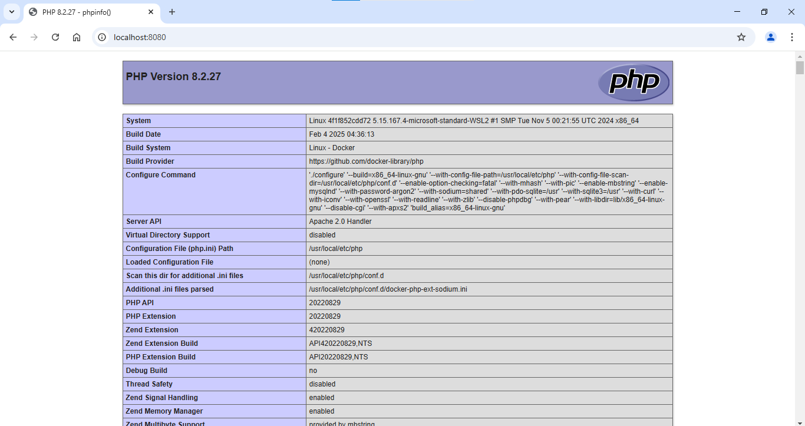

# Création de index.php :
Avec la commande pour afficher les infos su serveur apache.
```
phpinfo();
```


# Création de Dockerfile :


# Création de l'image :



# Lancement du conteneur :



# Résultat dans le navigateur :




