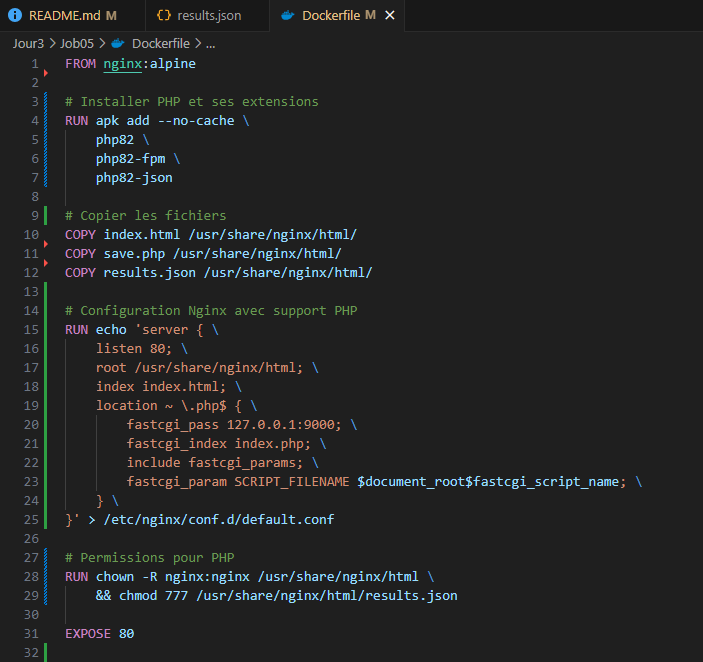
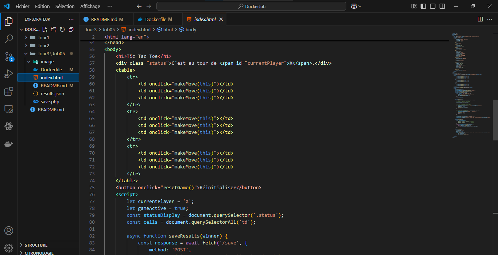
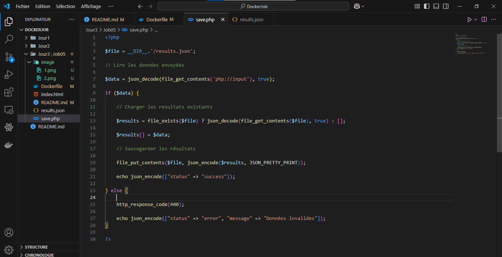
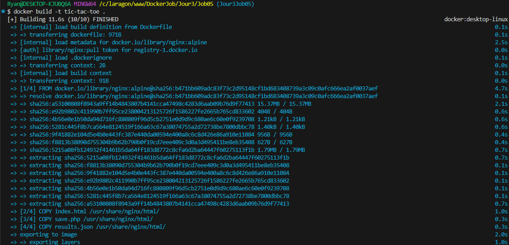
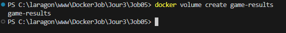
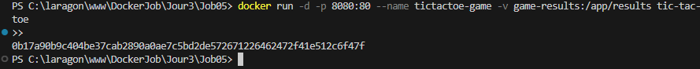
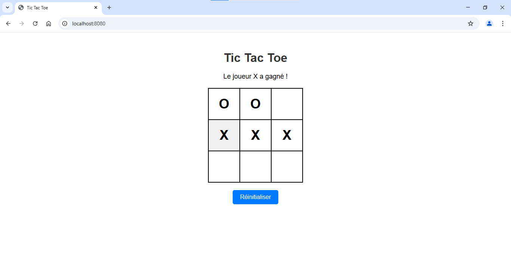

# Création du Dockerfile :  



# Création des fichiers :

index.html :  



save.php :



results.php :


# Construction de l'image :

```
docker build -t tic-tac-toe .
```




# Construction du volume :

```
docker volume create game-results
```




# Exécution du conteneur avec le volume :

```
docker run -d -p 8080:80 --name tictactoe-game -v game-results:/app/results tic-tac-toe
```

-v game-results:/app/results → Monte un volume game-results sur /app/results dans le conteneur.



# Résultat :

localhost:8080 :  


