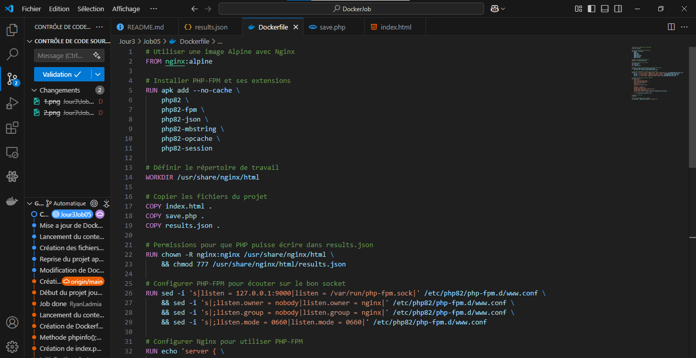
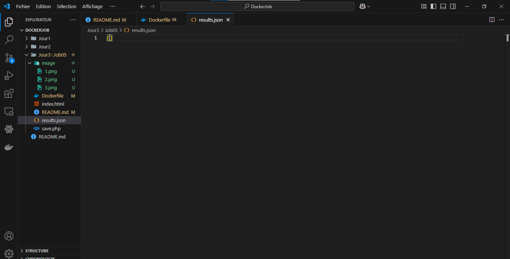
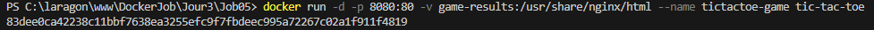

# Création du Dockerfile :  



# Création des fichiers :

index.html :  


save.php :


results.php :




# Construction de l'image :

```
docker build -t tic-tac-toe .
```


# Construction du volume :

```
docker volume create game-results
```


# Exécution du conteneur avec le volume :

```
docker run -d -p 8080:80 -v game-results:/usr/share/nginx/html --name tictactoe-game tic-tac-toe
```

-v game-results:/app/results → Monte un volume game-results sur /app/results dans le conteneur.



# Résultat :

localhost:8080 :  


# Vérifier la création du volume :

```
docker volume ls
```
Lister tous les volumes Docker disponibles sur le système.


# Inspecter le conteneur : 
```
docker exec -it tictactoe-game ls -l
```


# Inspecter le volume :

```
 docker volume inspect game-results
```
Cette commande affiche les détails du volume nommé game-results, notamment :  
Son chemin sur l'hôte (Mountpoint)  
Son ID unique  
Son utilisation par les conteneurs  
Son driver de stockage
 


# Lister les fichiers du conteneurs :

```
docker exec -it tictactoe-game ls /usr/share/nginx/html
```
Lister les fichiers dans /usr/share/nginx/html à l'intérieur du conteneur.


# Afficher les résultats :

```
docker exec -it tictactoe-game cat /usr/share/nginx/html/results.json
```
 Afficher le contenu du fichier results.json dans le conteneur.  


# Arrêter le conteneur :

```
docker stop <id_du_conteneur>
```


