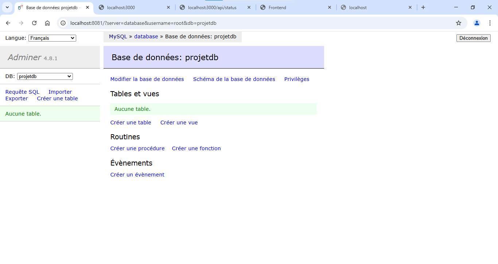
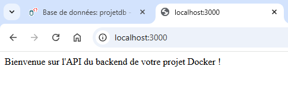
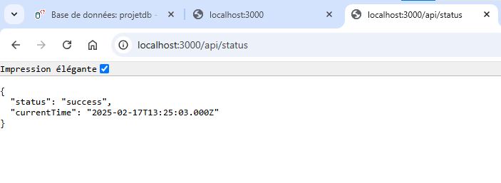
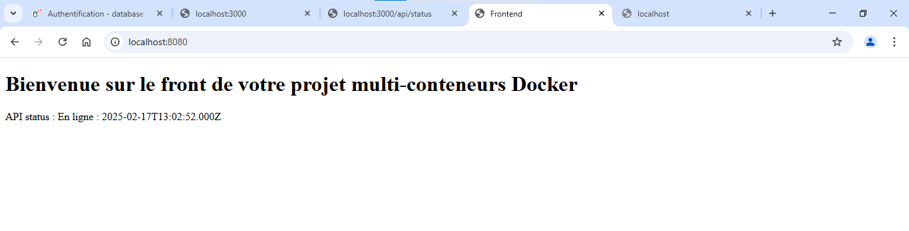
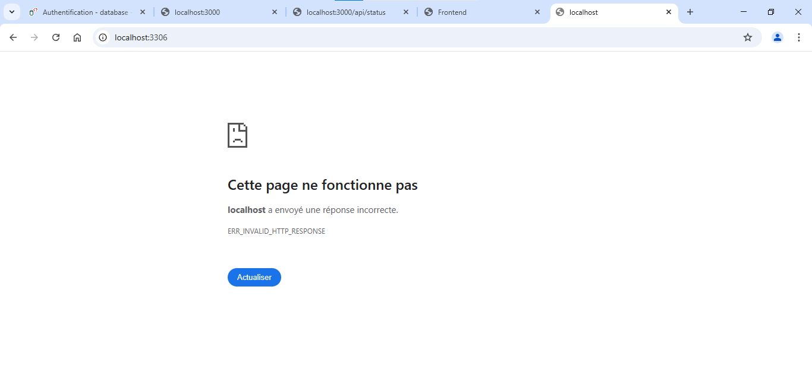
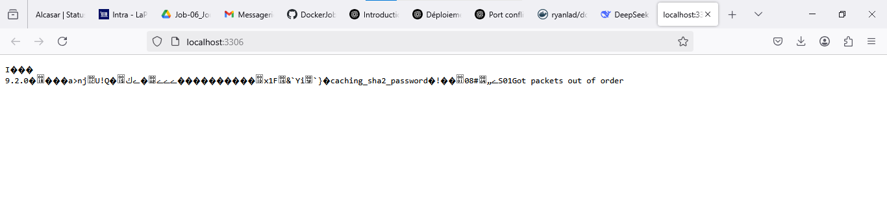
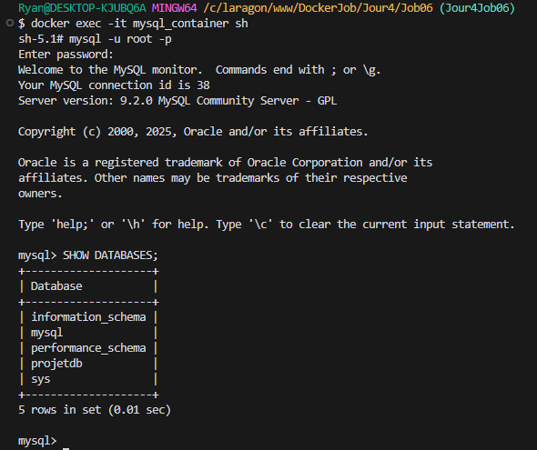
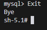

# Fichier docker-compose.yml :


# Structure du dossier :


# Connexion entre les services :




# Démonstration :
  

  
  

  
  

Authentification :  

  


Etat de l'API :

  


Accès à mysql :

Sur Chrome :



Sur FireFox :

  

Pour accéder au container et donc au mysql en invite de commande :  
```
docker exec -it mysql_container bash
```

Puis :  
```
mysql -u root -p
```
Pour se connecter. Le mot de passe ne se voit pas pour des raisons de sécurité. On doit le saisir à l'aveugle.  
Une fois cela fait :  
  
```
SHOW DATABASES;
```

 


Pour quitter le shell MySQL :
```
Exit
```
ou
```
Quit
```

 
