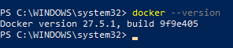
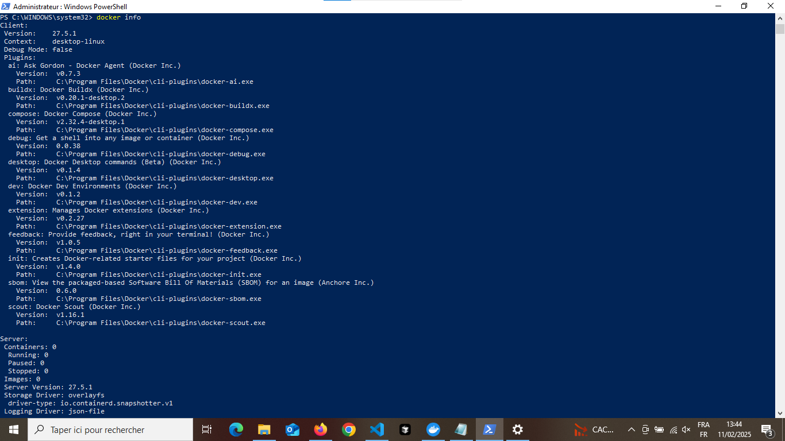
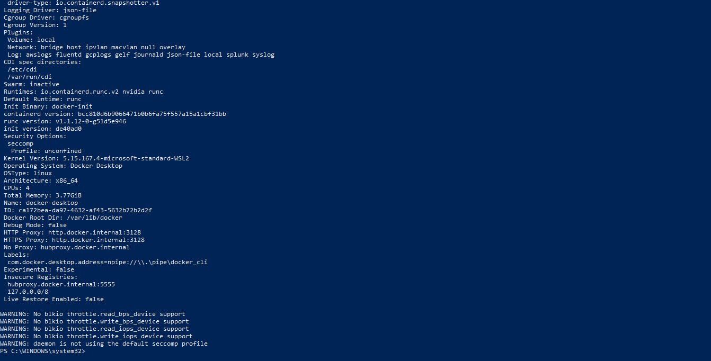

# **Docker Les Bases :**

Ce projet a pour but de fournir des informations sur les bases du fonctionnement de Docker.

## Auteur :

[Ryan Ladmia](https://www.github.com/RyanLadmia)  

Adresse email : ryan.ladmia@laplateforme.io


## A Propos de moi :

Je suis un developpeur fullstack, actuellement en formation à La Plateforme l'école du numérique.  
J'envisage de m'orienter vers la conception d'applications puis vers la cybersécurité.


## Utilisation :

**1. Vérifier la version de Docker :**
```
docker --version
``` 
Cette commande permet de vérifier si Docker est installé sur le système et quelle est sa version.  

Exemple :



**2. Informations générales :**
```
docker info
```
Cette commande permet d'afficher des informations générales sur l'installation de Docker (nombre de conteneurs actifs, images stockées, etc.).

Exemple :





